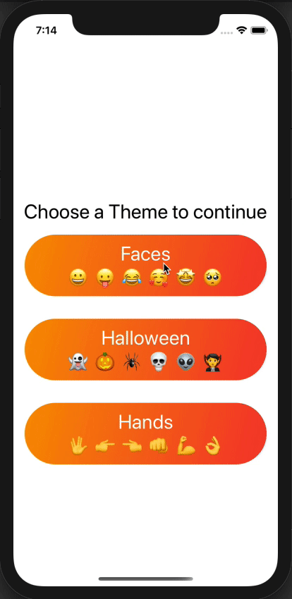

# iOS Swift UI Stanford Course

Studying iOS native development using Swift and Swift UI in [Stanford Course](https://cs193p.sites.stanford.edu/)

## Course Style

This course besides theoretical classes, has exercises. It makes each project unique in some way. Down here you can check the GIFs of the results I got.

## Memorize Game

